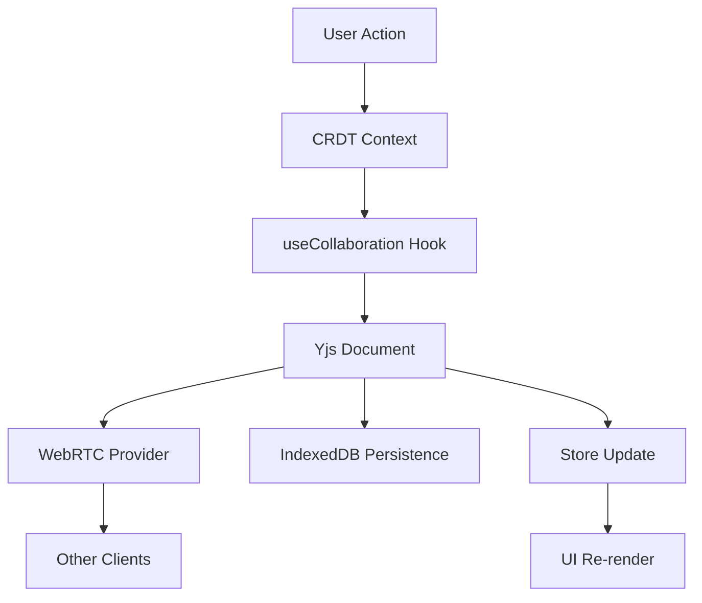

# Photo Journal - CRDT-First Real-Time Collaboration

A modern, real-time collaborative photo journal application built with React, TypeScript, and Yjs for seamless multi-user editing experiences.

## 🚀 Recent Major Update: CRDT-First Architecture

### Overview
The application has been completely refactored to use a **CRDT-first architecture** powered by Yjs, eliminating the dual legacy/modern system and ensuring all note operations are real-time, offline-capable, and conflict-free.

### Key Changes Made

#### 1. **Eliminated Dual System Architecture**
- **Before**: Mixed legacy content blocks (REST) + modern notes (Yjs)
- **After**: Single CRDT-first system using Yjs for all operations
- **Removed**: All `/api/content-blocks` REST calls for board notes
- **Removed**: Legacy mappers (`blockToNote.ts`, `noteToBlockPatch.ts`)

#### 2. **New CRDT Context System**
- **Created**: `client/src/contexts/crdt-context.tsx` - Provides Yjs-based note operations
- **Features**: 
  - `createNote()` - Creates notes directly in Yjs document
  - `updateNote()` - Updates notes through CRDT
  - `deleteNote()` - Deletes notes from CRDT
  - `isConnected` - Connection status indicator

#### 3. **Enhanced Collaboration Hook**
- **Updated**: `client/src/hooks/useCollaboration.ts`
- **Added**: Direct CRUD operations to Yjs document
- **Added**: Connection status tracking
- **Improved**: Error handling and retry logic

#### 4. **Refactored Components**
- **Updated**: `StickyBoard.tsx` - Now uses CRDT operations exclusively
- **Updated**: `workspace.tsx` - Uses CRDT context instead of legacy functions
- **Updated**: `collaboration-panel.tsx` - "Add Content" sidebar now uses CRDT
- **Added**: Connection status indicator in board UI

#### 5. **Simplified Store**
- **Removed**: Legacy sync queue and REST-based synchronization
- **Simplified**: Store now only handles local state management
- **Maintained**: Security validation and asset cleanup

### Architecture Flow



### Benefits Achieved

#### ✅ **Real-Time Collaboration**
- Instant synchronization across all connected clients
- Conflict-free merging using CRDT algorithms
- Offline capability with automatic sync when reconnected

#### ✅ **Performance Improvements**
- No more REST API calls for note operations
- Reduced network overhead
- Immediate local updates with optimistic UI

#### ✅ **Better User Experience**
- No perceptible lag during editing
- Smooth real-time cursor tracking
- Connection status indicators

#### ✅ **Simplified Architecture**
- Single source of truth (Yjs document)
- Eliminated complex dual-system mapping
- Cleaner, more maintainable codebase

### Usage Examples

#### Creating a Note
```typescript
import { useCRDT } from '@/contexts/crdt-context';

function MyComponent() {
  const { createNote } = useCRDT();
  
  const handleAddNote = () => {
    const noteId = createNote('text', {
      x: 100,
      y: 100,
      width: 200,
      height: 150,
      rotation: 0
    });
  };
}
```

#### Updating a Note
```typescript
import { useCRDT } from '@/contexts/crdt-context';

function MyComponent() {
  const { updateNote } = useCRDT();
  
  const handleUpdateNote = (noteId: string) => {
    updateNote(noteId, {
      content: { type: 'text', text: 'Updated content' }
    });
  };
}
```

#### Deleting a Note
```typescript
import { useCRDT } from '@/contexts/crdt-context';

function MyComponent() {
  const { deleteNote } = useCRDT();
  
  const handleDeleteNote = (noteId: string) => {
    deleteNote(noteId);
  };
}
```

### Migration Guide

#### For Existing Components
1. **Replace** `useJournal().createContentBlock()` with `useCRDT().createNote()`
2. **Replace** `useJournal().updateContentBlock()` with `useCRDT().updateNote()`
3. **Replace** `useJournal().deleteContentBlock()` with `useCRDT().deleteNote()`
4. **Wrap** components with `CRDTProvider` if not already wrapped

#### Type Mapping
```typescript
// Legacy to New Type Mapping
"sticky_note" → "sticky_note"
"text" → "text"
"checklist" → "checklist"
"photo" → "image"
"audio" → "voice"
"drawing" → "drawing"
```

### Technical Details

#### Yjs Configuration
- **Room Name**: `journal-board-${spaceId}` (separates different boards)
- **Signaling**: `wss://signaling.yjs.dev` (WebRTC peer discovery)
- **Persistence**: IndexedDB for offline storage
- **Awareness**: Real-time cursor and selection tracking

#### Security Features
- Input sanitization for all content
- Rate limiting per user
- Asset cleanup and memory management
- XSS protection

#### Performance Optimizations
- CRDT echo throttling (150ms) to prevent local update loops
- RAF-based smooth animations
- Debounced position updates (100ms)
- Optimistic UI updates

### Future Enhancements

1. **Enhanced Offline Support**: Better conflict resolution for long offline periods
2. **File Upload Integration**: Direct file uploads to cloud storage
3. **Advanced Collaboration**: Comments, annotations, and version history
4. **Mobile Optimization**: Touch gesture improvements and responsive design

---

## Original README Content

[Previous README content would go here...]